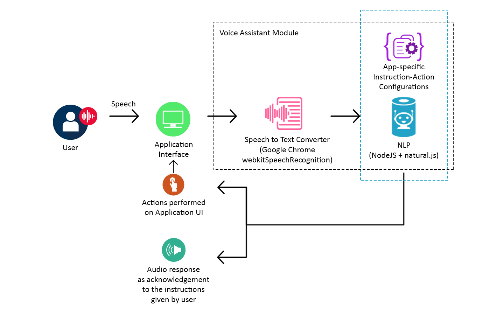

# Mobile Demo Application

[Demo](https://anirbannath.github.io/mobile-demo/)

This application is created to demostrate a basic mobile application enabling basic voice interaction capibilities and theming.

The source code suggests best practices which should be followed while developing an Angular application and is mainly designed targeting mobile platforms (like Android/iOS).

It doesn't use any server-side API for fetching or saving data. It uses some static JSON files for retrieving data and uses IndexedDB for saving data.

However, it uses a few Node.JS APIs for processing voice instructions.

Under the hood, in the client-side, this application uses NgRx for state management and webkitSpeechRecognition for voice navigation.

> Some assistant features need Node.JS APIs. Thus, the Github Pages may not work properly. Please run the application locally.
>
> To run locally do `npm install` followed by `npm start`.
>
> Also, some of its features may only work properly on Google Chrome (yet a few features may not work for iOS even with Google Chrome).

## Voice assistant commands

To activate voice assistant go to the settings page and activate Voice Assistant. Or you may start the assistant by clicking the top right button in the start-up page.

Here are some commands which can be used in the application:

- Go to home
- Take me to contacts
- Navigate to client page
- Create note
- Create a note
- Discard (For going to the previous page)
- Cancel (For going to the previous page)
- Save
- Edit
- You can dictate to the assistant once it goes into the Edit Note screen.

## Project Architecture

